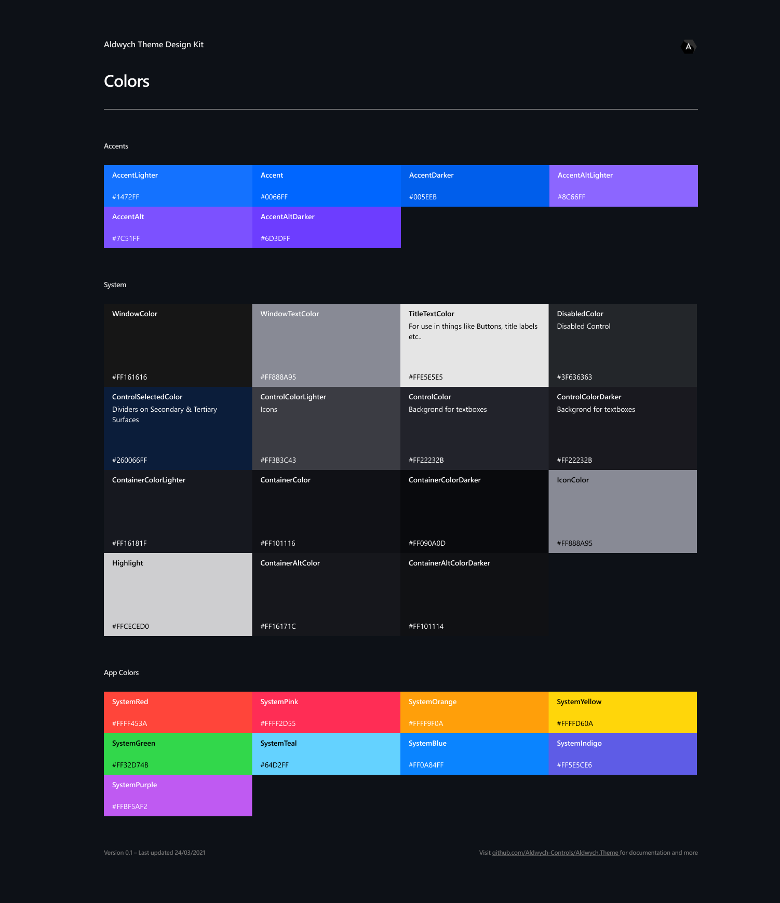
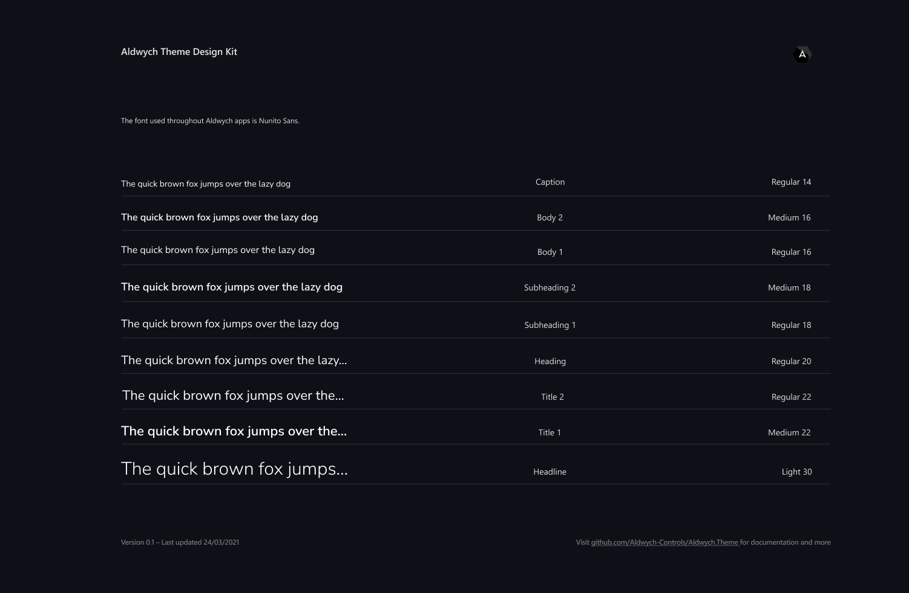

# 🦁 Aldwych.Theme
The Avalonia UI style used for Aldwych. 

## Colors 

## Typography

## Basic Input 

### Button 

**Enabled**

**Disabled**

**Default**

---

### Combobox 

**Default**

**Expanded**

---
### Checkbox 

**Unchecked**

**Checked**

**Third State**

**Disabled**

---
### Radio Button 

**Unchecked**

**Checked**

**Disabled**

---

## Collections 

## Data & Time 

## Menus 

## Navigation

## Status & Info 

## Text 

